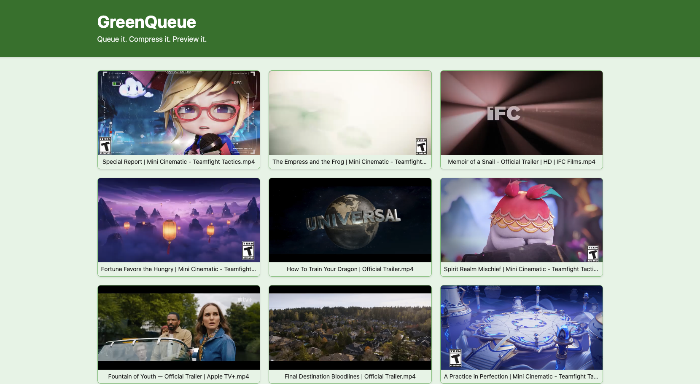

# STDISCM S12 Problem Set 3: GreenQueue - Video Processing Service

- GON GON, Zhoe Aeris F.
- SULIT, Anne Gabrielle M.
- TORIO, Ysobella D.
- [GitHub Repo](https://github.com/axsulit/stdiscm-pset3)

## Overview
A producer-consumer exercise demonstrating concurrent programming, file I/O, queueing, and network communication. This project simulates a media upload service with video compression capabilities.

## Features

- Multiple producer threads for video uploads
- Multiple consumer threads for video processing
- Video compression using FFmpeg
- Real-time video preview on hover
- Queue management with configurable size
- Docker support 

## Prerequisites

- Java 17 or higher
- Gradle 8.x
- FFmpeg (for video compression)
- Docker and Docker Compose (for containerization)

## Project Structure

```
stdiscm-pset3/
├── consumer/           # Consumer service (video processing)
├── producer/           # Producer service (video upload)
└── shared/            # Shared code and resources
```

## Configuration

The application can be configured through `shared/src/main/resources/config.properties`:

```properties
producer.threads=2              # Number of producer threads, must be > 0
producer.rootvideopath=./videos # Path to video source directory, must be absolute path
consumer.threads=3              # Number of consumer threads, must be > 0
queue.length=4                  # Maximum queue size, must be > 0
environment=local              # Environment (local/docker)
```

## Sample Videos

Sample videos can be downloaded from [this Google Drive link](https://drive.google.com/file/d/1X1sYJudX0-CtuEzKRzutQ0I_KlupHJ0D/view?usp=sharing). After downloading:

1. Extract the downloaded file
2. Move the extracted folders to your configured video path (specified by `producer.rootvideopath` in config.properties)

## Building and Running

### Local Development

1. Generate Gradle wrapper (if not present):
```bash
gradle wrapper
```

2. Build the project:
```bash
./gradlew build
```

3. Start the consumer service:
```bash
./gradlew :consumer:run
```

4. In a new terminal, start the producer service:
```bash
./gradlew :producer:run
```

The consumer service will be available at `http://localhost:8080`.

### Docker Deployment

1. Build and run using Docker Compose:
```bash
docker-compose up --build
```

This will start both the producer and consumer services in containers.
The consumer service will be available at `http://localhost:8080`.

## Usage

1. Place video folders in the configured `producer.rootvideopath` directory
2. Access the web interface at `http://localhost:8080`
3. Hover over videos to preview them (10-second preview)
4. Click on a video to play it in full screen

## How It Works

### Producer Service
1. Monitors configured video folders for new videos
2. When a video is detected:
   - Checks if the consumer's queue has space
   - If space available, uploads the video to the consumer
   - If queue is full, waits and retries
3. Each producer thread handles a separate folder
4. Supports concurrent uploads with retry logic

### Consumer Service
1. Listens for incoming video uploads
2. When a video is received:
   - Adds it to the processing queue
   - If queue is full, rejects new uploads
3. Processes videos from the queue:
   - Compresses videos using FFmpeg
   - Saves processed videos to storage
   - Updates the web interface
4. Multiple consumer threads process videos concurrently

### Queue Management
- Fixed-size queue (configurable via `queue.length`)
- Producer checks queue status before uploading
- Consumer processes videos in order
- Queue full status is communicated to producers

### Web Interface
- Real-time display of processed videos
- 10-second preview on hover
- Full-screen playback on click
- Updates automatically as new videos are processed

